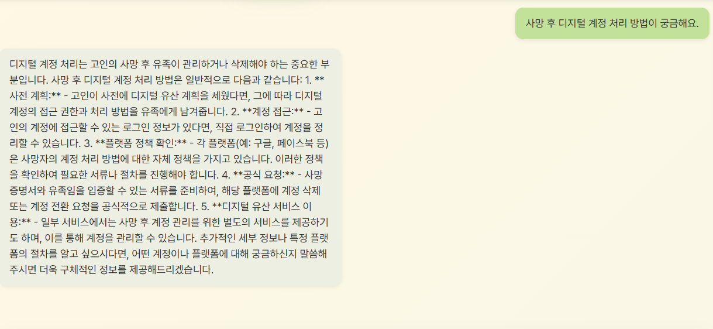
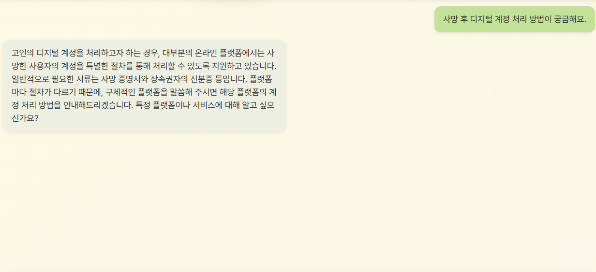
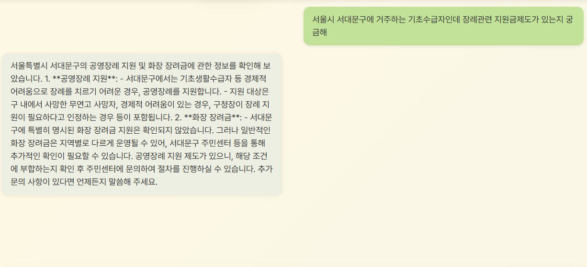
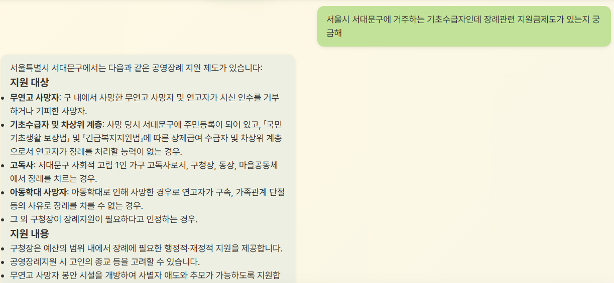
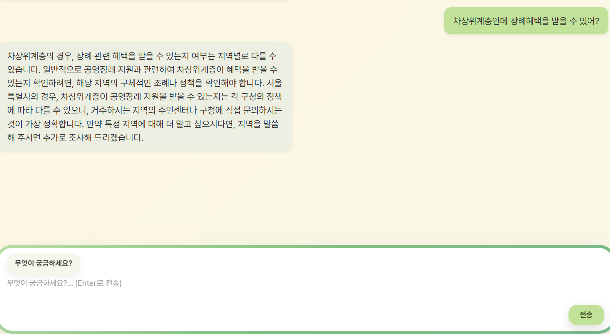
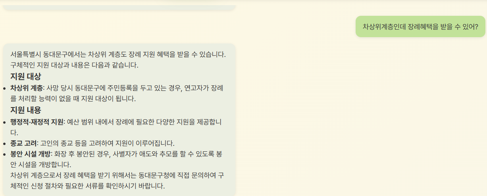

> SK네트웍스 Family AI 캠프 19기 4차 프로젝트  
> 개발기간: 25.11.26 ~ 25.12.17  
> 주제 : LLM을 연동한 내외부 문서 기반 질의 응답 시스템

 

---

# 📚 목차

1. [팀 소개](#%EF%B8%8F-%ED%8C%80-%EC%86%8C%EA%B0%9C)
2. [프로젝트 개요](#-%ED%94%84%EB%A1%9C%EC%A0%9D%ED%8A%B8-%EA%B0%9C%EC%9A%94)
3. [기술 스택 & 사용한 모델](#-%EA%B8%B0%EC%88%A0-%EC%8A%A4%ED%83%9D--%EC%82%AC%EC%9A%A9%ED%95%9C-%EB%AA%A8%EB%8D%B8)
4. [시스템 아키텍처](#%EC%8B%9C%EC%8A%A4%ED%85%9C-%EC%95%84%ED%82%A4%ED%85%8D%EC%B2%98)
5. [WBS](#-wbs)
6. [요구사항 명세서](#%EF%B8%8F%E2%83%A3-%EC%9A%94%EA%B5%AC%EC%82%AC%ED%95%AD-%EB%AA%85%EC%84%B8%EC%84%9C)
7. [화면 설계서](#️-화면-설계서)
8. [테스트 계획 및 결과 보고서](#-%ED%85%8C%EC%8A%A4%ED%8A%B8-%EA%B3%84%ED%9A%8D-%EB%B0%8F-%EA%B2%B0%EA%B3%BC-%EB%B3%B4%EA%B3%A0%EC%84%9C)
9. [트러블 슈팅](#-%ED%8A%B8%EB%9F%AC%EB%B8%94%EC%8A%88%ED%8C%85)
10. [수행결과(시연 페이지)](#-%EC%88%98%ED%96%89%EA%B2%B0%EA%B3%BC%EC%8B%9C%EC%97%B0-%ED%8E%98%EC%9D%B4%EC%A7%80)
11. [한 줄 회고](#%EF%B8%8F-%ED%95%9C-%EC%A4%84-%ED%9A%8C%EA%B3%A0)

 

---

# 🖐️ 팀 소개

- ## 팀명 : **맺음**
- ### 팀원 소개 :

	
| [@배상준](https://github.com/WindyAle) | [@박소희](https://github.com/xxoysauce) | [@이승원](https://github.com/seungwon-sw) | [@김성욱](https://github.com/souluk319) | [@박진형](https://github.com/vispi94) |
| :----------------------------------------: | :----------------------------------------: | :----------------------------------------: | :----------------------------------------: | :----------------------------------------: |
|  |  |  |  |  |

 

---

# 📖 프로젝트 개요

##  주제 : 남은 인생을 후회 없이 잘 살고, 품위 있는 끝맺음을 준비하며,   새로운 삶의 의미를 찾아가는 과정을 돕는 AI 기반의 '대화 상대' 챗봇 서비스

- ###  **프로젝트 소개**

"**라잎클로버**"는 사용자가 남은 삶을 정돈하고 의미를 찾을 수 있도록 돕는 AI 대화형 챗봇 서비스입니다.  
**상속, 장례 절차, 인터넷 계정 관리, 정서 상담 등 다양한 주제를 RAG 기반으로 안내**하며  
**사용자의 감정·기억까지 반영된 맞춤형 대화를 제공**합니다.

- ###  **프로젝트 배경**

"삶의 마무리 과정(상속·장례·연명의료 등)에 대한 정보 수요가 증가하고 있지만, 
궁금한 정보를 다양하게 제공하거나 정서적 부담으로 주변에 쉽게 이야기하기 어려운 고민을 
한 곳에서 상담/안내해주는 통합 서비스는 부족합니다."

- **현대 사회 이슈**
   -   고령화 사회 심화
   -   독거노인 + 1인 가구 증가
   -   무연고자 사망 증가

관련 기사

### ■ 무연고 사망 증가

- 무연고 사망자는 년마다 증가하는 추세이며, 통계에 잡히지 않는 불특정 다수도 있어 관심과 대책이 요망됨.

[https://repository.kli.re.kr/bitstream/2021.oak/6926/2/%EB%85%B8%EB%8F%99%EB%A6%AC%EB%B7%B0_no.208_2022.7_7.pdf](https://repository.kli.re.kr/bitstream/2021.oak/6926/2/%EB%85%B8%EB%8F%99%EB%A6%AC%EB%B7%B0_no.208_2022.7_7.pdf)
##### 출처: 보건복지부

### ■ 고령화 + 1인 가구

-   한국은 2025년 초고령사회 진입.
    
-   노년층 1인 가구 폭증 → 죽음 준비·장례 절차의 정보 접근성 낮음.    
[https://kostat.go.kr/portal/korea/kor_nw/1/1/index.board?bmode=read&aSeq=429567?utm_source=chatgpt.com](https://kostat.go.kr/portal/korea/kor_nw/1/1/index.board?bmode=read&aSeq=429567?utm_source=chatgpt.com)
##### 출처: 통계청

## 해외 죽음 준비 문화 동향
	
### ■ 일본의 ‘슈카츠(終活, Shukatsu)’ 확산

-   일본에서는 **자기 죽음을 준비하는 활동 전체**를 가리키는 말로 ‘슈카츠(終活)’가 이미 널리 사용됨. [위키백과](https://en.wikipedia.org/wiki/Shukatsu_%28end-of-life_planning%29?utm_source=chatgpt.com)

-   주체적인 삶의 마무리, 남겨진 가족의 부담 경감, 현재 삶의 재발견과 성찰, 물리적 정리를 대비하는 문화 
   Shukatsu 개념 정리(위키피디아)  
   )[https://en.wikipedia.org/wiki/Shukatsu_(end-of-life_planning)](https://en.wikipedia.org/wiki/Shukatsu_(end-of-life_planning))

### ■ 미국 – Legacy AI / Digital Afterlife 시장 등장

- “StoryWorth”: AI 기반 인생 회고 스토리북 생성 서비스 → 미국에서 급성장.
    
    출처: StoryWorth 공식
    
    https://welcome.storyworth.com/?utm_source=chatgpt.com
    
- “HereAfter AI”: AI가 사용자의 생전 음성·이야기를 기록 → 유족이 대화 가능.
    
    출처: HereAfter
    
    https://www.hereafter.ai/?utm_source=chatgpt.com

 

#### => 해외에는 `웰다잉 Well Dying (남은 삶을 어떻게 잘 살아내고 마무리할 것인지)` 문화가 성행하나 국내에선 낯설고 관심 부족한 상태
	
### "이러한 배경에서 저희는 **신뢰할 수 있는 안내/대화 서비스의 필요성**을 느끼고 도움을 줄 수 있는 챗봇을 구상하게 되었습니다."

- ### **프로젝트 목표**

1.  **핵심 정보 제공**: 상속·장례·인터넷 개인정보 처리 등 삶의 마무리에 필요한 정보를 정확하게 안내
    
2.  **맞춤형 대화**: 감정·기억을 반영한 개인화된 상담 제공
    
3.  **RAG 기반 정확성 향상**: GPT-4o + Pinecone으로 근거 기반 답변 생성
    
4.  **사용자 중심 UI 구현**: (여기에 구현 프로그램 명 입력) 을 사용한 모바일 최적화 인터페이스로 간편한 이용 환경 제공

 

---

# 💻 기술 스택 & 사용한 모델  

| 분야                | 사용 도구 |
|---------------------|-----------|
| **Language**        |  |
| **Collaboration Tool** |     |
| **LLM Model**       |  
| **Embedding Model** |  |
| **Vector DB**       |  |
| **Orchestration / RAG** |   |
| **Web Framework** |  |
| **Development Env** |  

 

---

# 🪢시스템 아키텍처

### 프로젝트 구조

 

### 시스템 아키텍처 구조도

 

---

# 📅 WBS

 

---

# *️⃣ 요구사항 명세서

**시작 페이지 관리 (SP)**

 

**안내 페이지 관리 (INFO)**

 

**채팅 페이지 관리 (CHAT)**

 

**회원 관리 (MBM)**

 

**세션 관리 (SES)**

 

**비기능 요구 사항 (NFR)**

 

 

---

# 🖥️ 화면 설계서

 

 

 

 

 

 

 

 

 

---

# 💡 테스트 계획 및 결과 보고서

정보 탭 테스트 진행 및 결과

 

**1. 테스트 목적 및 판단 기준**

| 구분           | 판단 기준                                     |
|--------------|------------------------------------------|
| 가독성          | 문단 분리, 목록화 등을 통해 한 번에 이해 가능한가       |
| 정보 정확성       | 법·의료·절차 정보 전달 시 잘못된 내용이 없는가          |
| 상황 대응 능력     | 대화의 문맥을 파악하는가   |

 

**2. 테스트 질문 바리에이션**

| 유형        | 질문 예시                         |
|-----------|----------------------------------|
| 가독성     | "사망 후 디지털 계정 처리 방법이 궁금해요."         |
| 정보 정확성  | "서울시 서대문구에 거주하는 기초수급자인데 장례관련 지원금제도가 있는지 궁금해."       |
| 상황 대응 능력     | "서울시 동대문구에 거주하는 기초수급자인데 장례관련 지원금제도가 있는지 궁금해"   → "차상위계층인데 장례혜택을 받을 수 있어?    |

 

**3. 테스트 중 발견된 문제점**

| 구분        | 발견된 문제                                 |
|-----------|------------------------------------------|
| 구조적 가독성 저하     | 줄 바꿈 없음 등 구조적 미흡으로 가독성 저하 |
| 답변 상태 미흡   | DB 내 연관된 데이터를 제대로 활용하지 못함    |
| 문맥 파악 실패   | 앞선 문맥을 파악하지 못해 예상과 다른 답변 출력 |

 

**4. 문제 개선을 위한 조치**

| 개선 항목     | 적용 내용                                               |
|-------------|------------------------------------------------------|
| 구조 보완   | 출력 문구의 구조 재구성, 사용자에게 정확한 질문 방법 제시          |
| 답변 상태 개선     | 데이터 활용 및 출력 방향 개선  |
| 문맥 프롬프트 조치 | 프롬프트 수정으로 자연스러운 대화 가능하도록 조치          |

 

**5. 개선 전 / 후 비교**

- 가독성

 

 

→ 줄 바꿈 등 구조 일괄 조정, 사용자에게 구체적인 질문 방법 제시

 

- 정보 정확성

 

 

→ 포괄적인 답변 대신 조건 별 정확한 정보 제공

 

- 상황 대응 능력

 

 

→ 앞서 동대문구 관련 질문을 하고 이어진 대화에서 문맥을 유지하여 올바른 답변 제출

 

 

대화 탭 테스트 진행 및 결과

 

**1. 테스트 목적 및 판단 기준**

| 구분       | 판단 기준                                 |
| -------- | ------------------------------------- |
| 감정 공감    | 사용자의 감정이 담긴 문장을 정확히 인식하고 맥락에 맞게 공감하는가 |
| 요청 의도 파악 | 감정 호소 / 해결책 요청 / 사실 질문 / 철학 질문을 구분하는가 |
| 전문성 대응   | 약·질병·치료 관련 질문에서 단정적 답변을 피하는가          |

 

**2. 테스트 질문 바리에이션**

| 유형     | 질문 예시                
| ------ | -------------------- | 
| 감정 중심  | “너무 아파서 미치겠어”      |  
| 해결책 요청 | “기억력 좋아지는 팁 알려줘”     |
| 정보 질문  | “항암 중 전복죽 먹어도 될까?”  |

 

**3. 테스트 중 발견된 문제점**

| 구분     | 발견된 문제              |
| ------ | ------------------- |
| 동문서답   | 해결책 요청에 감정 위로만 제공   |
| 부적절 대안 | 고통 강도 대비 산책·TV 등 제안 |
| 앵무새 공감 | 약물명 반복, 의미 해석 부족    |

 

**4. 문제 개선을 위한 조치**

| 개선 항목 | 적용 내용                     |
| ----- | ------------------------- |
| 요청 분기 | “팁/방법/추천” 포함 시 정보 요청으로 분류 |
| 검색 도구 | 사실·검증 가능한 정보에 Tavily 사용   |
| 고통 필터 | 고통 점수 높을 시 기분전환 제안 제한     |
| 의료 표현 | 약물명 반복 대신 치료 상황으로 해석      |

 

**5. 개선 전 / 후 비교**

(여기에 before 이미지)

(여기에 after 이미지)

 

---

# 🐛 트러블 슈팅

 

---

# 🤖 수행결과(시연 페이지)

 

---

# ✒️ 한 줄 회고

| 이름 | 회고 |
|----------|-------------|
| 배상준 |  |
| 박소희 |  |
| 이승원 |  |
| 김성욱 |  |
| 박진형 |  |
